# Protokoll E-Befischung

Web application replacing the Fischereiforschungsstelle Baden-Württemberg's PDF-based
electrofishing survey form, with drafts, review, and a controlled path into the state fisheries
database.

The legacy form is a four page PDF that only works in Adobe Acrobat with JavaScript switched on.
It cannot save a half-finished survey, has no review step, no search across past surveys and no
audit trail, and it carries validation bugs that have let incorrect data through for years. This
application replaces it.

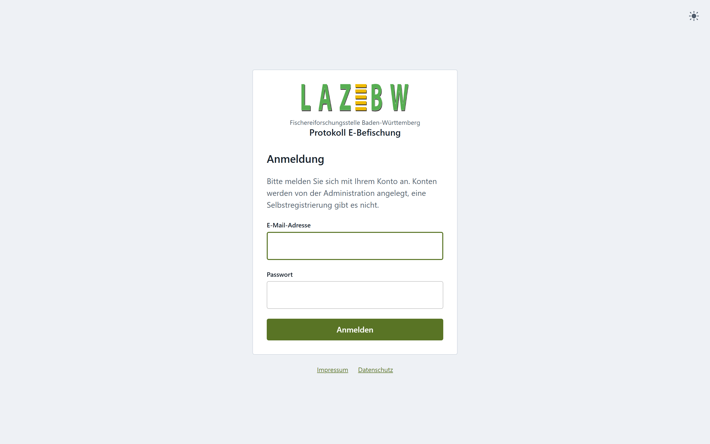

## Where the build has got to

Everything shown on this page is built and running. The numbering follows
[blueprint/build-plan.md](blueprint/build-plan.md).

| # | Feature | State |
|---|---|---|
| 1 | Project skeleton: Docker, PostgreSQL with PostGIS, FastAPI, React shell, theme, translations | Done |
| 2 | Accounts and login: six roles, JWT in an httpOnly cookie, first-admin command | Done |
| 3 | Draft lifecycle: create, save automatically, local safety copy, "Meine Protokolle" | Done |
| 4 to 9 | The protocol itself, all six parts, roughly 338 fields and every rule | Done |
| 10 | Map excerpt and photo upload | Done |
| 11 | Submit and review workflow: the state machine, rejections, change requests, locking | Done |
| 12 | Review queue: list, filters, free-text search, search by species | 12a to 12c done, 12d open |
| 23 | Import a filled legacy PDF as a draft | Next |
| 13 to 17 | Regional access, notifications, audit trail, user administration, English | Open |

After the MVP: the map picker and official water body dataset, transfer to FiaKa, PDF generation,
the Protokoll Krebs, and offline field use.

## The flow, end to end

### 1. Sign in

There is no sign-up page, by design. Every account is created by an administrator, so an external
consultant or angling association cannot give themselves access. See
[Creating the first account](#creating-the-first-account) below.

### 2. Your own protocols

A submitter lands on **Meine Protokolle**: their own surveys and nothing else. Drafts can be
resumed or discarded; anything already handed in can be read back but not changed.

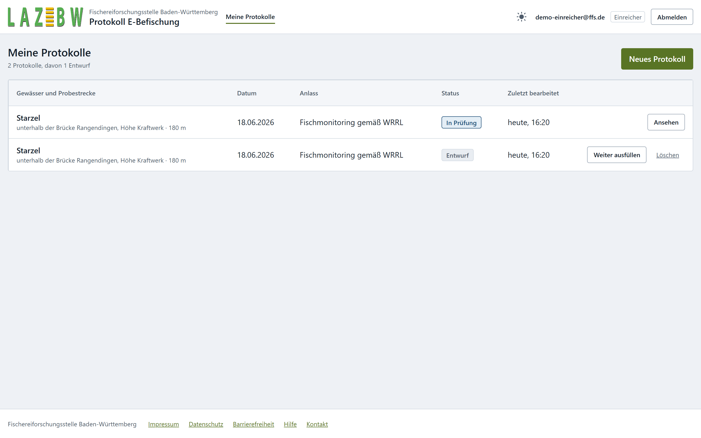

FFS staff land on the **Prüfliste** instead, because their job starts with other people's work.
Their own protocols stay one click away.

### 3. Fill in the protocol, over as many sittings as it takes

The protocol is long, so it is split into seven sections shown one at a time. **Any section can be
opened at any time.** Forcing people through in order is what makes a surveyor type a placeholder
value to get past a gate and never come back.

Saving is automatic and its state is always visible, in the top right.

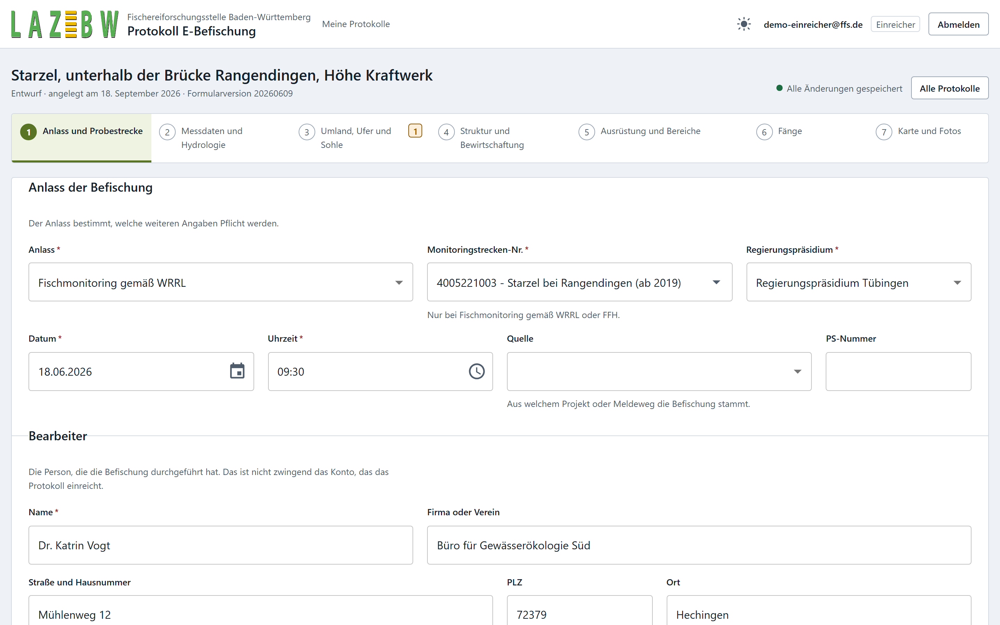

The Probestrecke, the surveyed stretch of water, carries the receiving-water chain and the
boundary coordinates. The chain has to end at the Rhein or the Donau, and the coordinates are
checked against Baden-Württemberg.

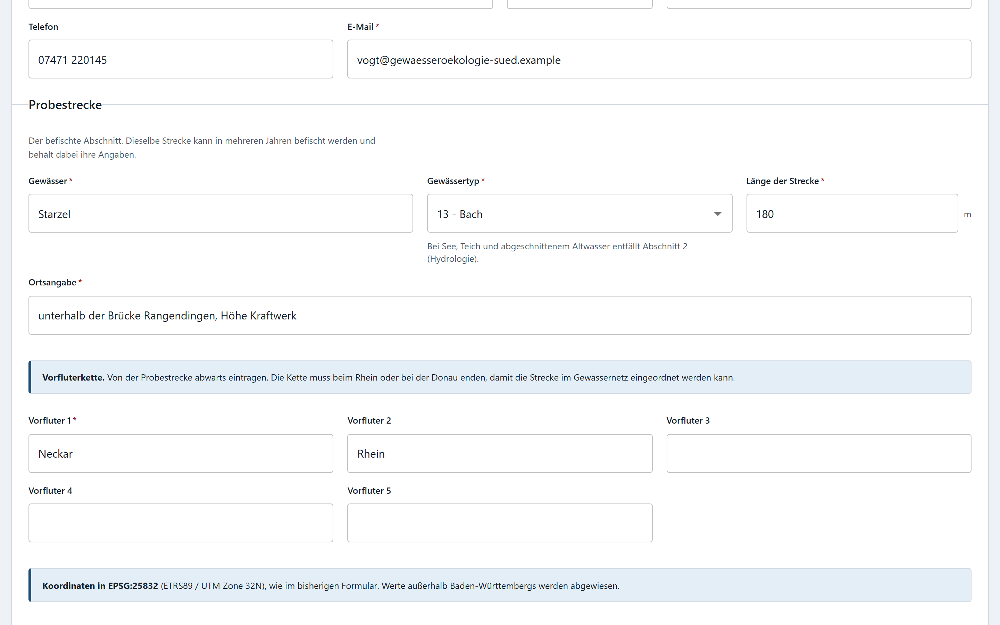

Part 2 holds the measurements and the hydrology. Hydrology disappears entirely for standing
waters, because a pond has no current to describe.

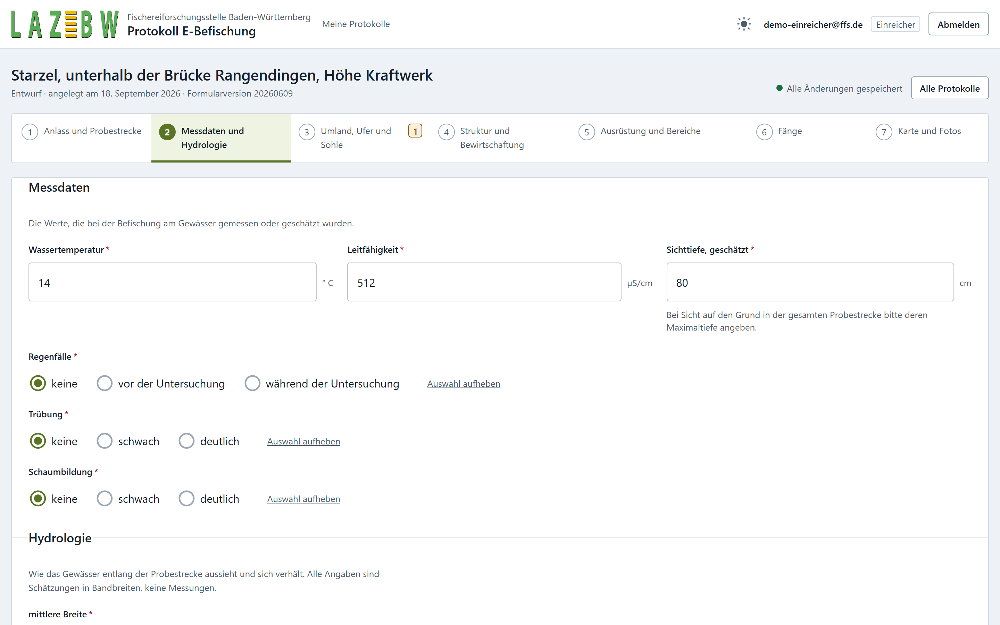

### 4. Rules that catch mistakes as they are made

Six blocks of the protocol are percentage splits that have to total exactly 100. Each one carries
a running total: green while it adds up, red with an explanation when it does not. The screenshot
below shows one of each.

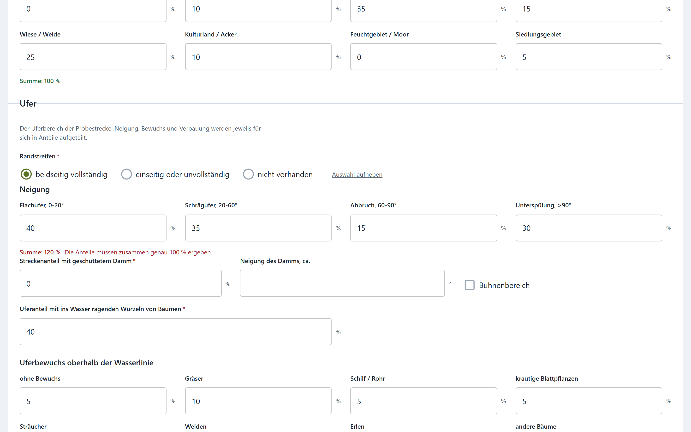

Every rule is written twice: once in the browser for instant feedback, once in Python on the
server, which is the one that actually decides. The browser half is a convenience and never a
gate.

### 5. The catch table

Part 6 is the hardest part of the form: up to 26 species over ten size classes, with live row
totals, a grand total, a picker over 123 species, and the rule that the young-of-year count can
never exceed the row it belongs to.

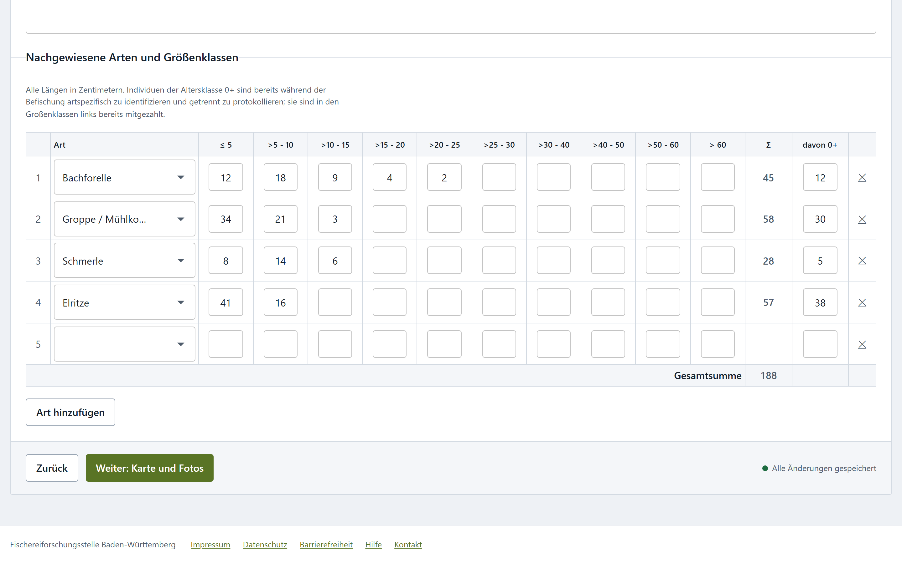

Light and dark are both supported throughout, defined as design tokens rather than hard-coded
colours.

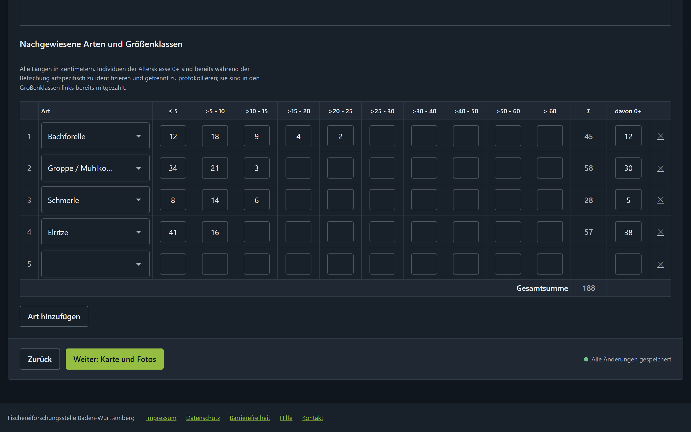

### 6. Attachments, then submit

The last section takes one map excerpt and up to twenty photographs, then hands the protocol in.

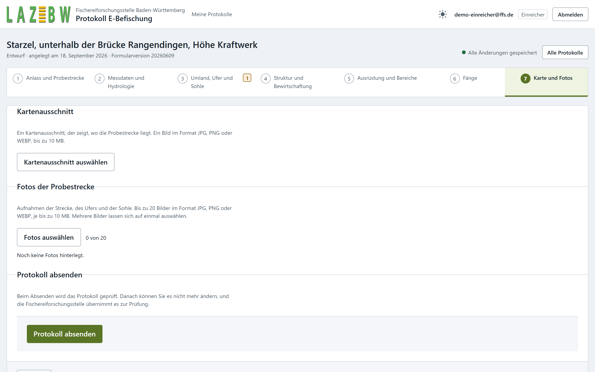

Submitting runs every rule on the server. If something is wrong, nothing is submitted and the
draft is left exactly as it was. Problems are shown next to the field they concern, with a count
on the step bar so you can see where to go. In the screenshot above, the orange **1** on section 3
is the 120 percent block from earlier.

### 7. Review

FFS staff see every submitted protocol in the **Prüfliste**, filtered by status, year, occasion,
and a free-text search over the water, the location and the monitoring number. The rightmost
filter searches inside the catch table, so "show me everywhere we found Groppe" is one selection.

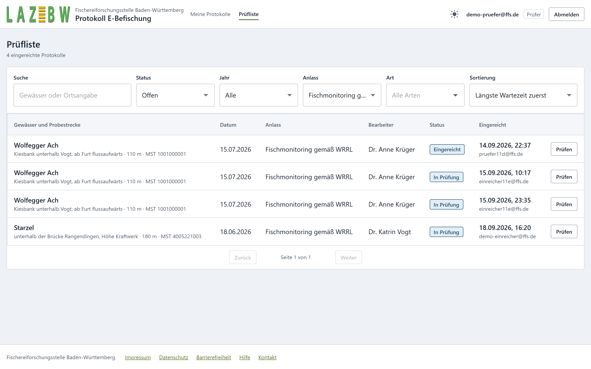

Opening one shows the whole protocol read-only, exactly as it was handed in, with the decision
rail on the right.

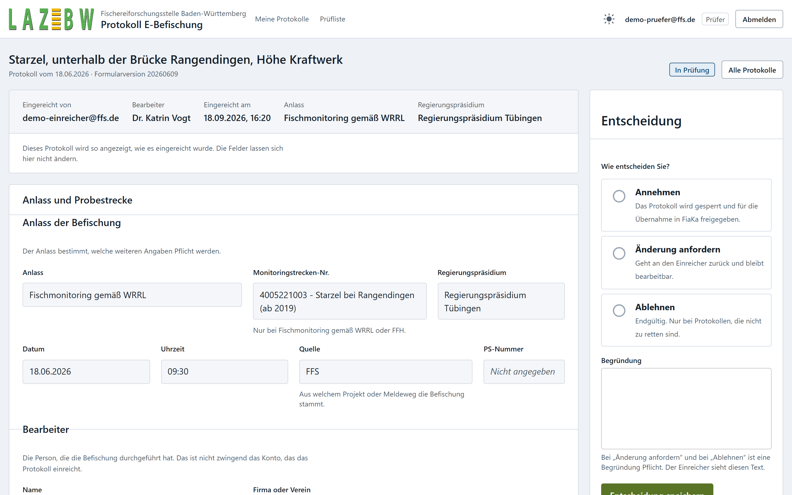

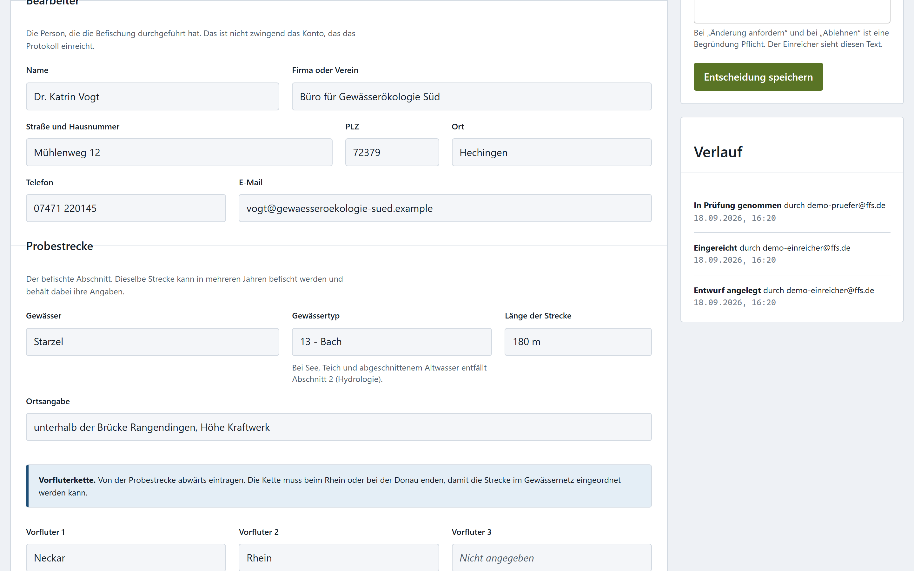

A reviewer can accept, reject, or request changes. Rejecting and requesting changes both require a
reason, which the submitter sees. Accepting locks the protocol.

### Accounts

There is no sign-up. Every account is made by an administrator, and the **Benutzerverwaltung**
is where they are read: who holds which role, which regional authority a regional account
belongs to, whether it can still be signed in to, and when it was made. The search narrows the
list by address. The administrator's own row is marked, because there are things they may not
do to it.

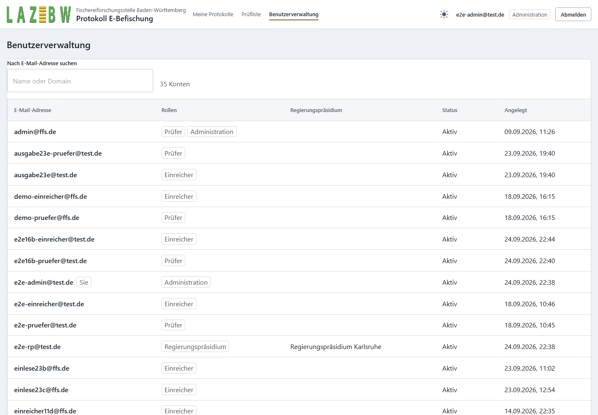

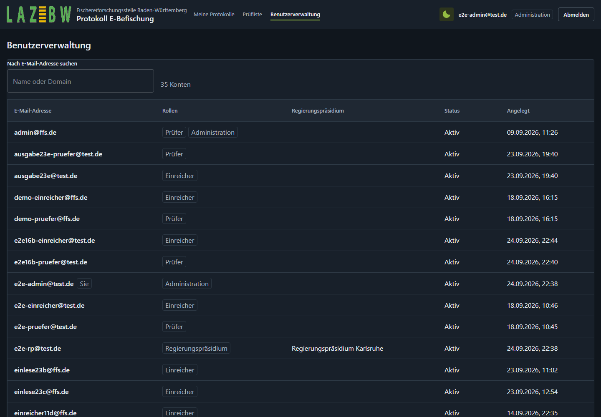

An account is never deleted, only locked: deleting one would take the owner of every protocol
it filed with it, and those records have to stay readable.

> The screenshots are of the real application driven through a browser, not mockups. The survey
> data in them is invented. See [docs/screenshots/](docs/screenshots/).

## Start here

| Document | What it covers |
|---|---|
| [docs/decisions.md](docs/decisions.md) | What we decided before building, and why. Written for non-developers too |
| [CONTEXT.md](CONTEXT.md) | The domain glossary. The German terms and what they mean |
| [blueprint/context/project-overview.md](blueprint/context/project-overview.md) | The data model, feature list and stack. The single source of truth |
| [docs/adr/](docs/adr/) | The six hard-to-reverse architecture decisions |
| [docs/ffs-defect-list.md](docs/ffs-defect-list.md) | Bugs found in the legacy PDF form, for FFS |
| [docs/deployment-vercel.md](docs/deployment-vercel.md) | Putting what is built so far on a real address, for showing FFS |
| [AGENTS.md](AGENTS.md) | How AI coding agents should work in this repository |

## Layout

```
frontend/     React + TypeScript, built by Vite
backend/      FastAPI + Python
database/     Alembic migrations and seed data
deployment/   Docker Compose, reverse proxy config
docs/         decisions, ADRs, the FFS defect list, screenshots
blueprint/    the plans and the build workflow
```

## Tech stack

| Technology | Role |
|---|---|
| React + TypeScript, built by Vite | The frontend, built to static files |
| React Hook Form | Form state. Required at 338 fields, where re-rendering everything per keystroke makes typing sticky |
| Zod | Browser-side validation for instant feedback. Never a gate |
| TanStack Query | Server calls, retries, and the automatic-save indicator |
| MUI | Components, themed hard against our own tokens |
| FastAPI + Python | The backend and the authoritative validation gate |
| Pydantic | Request and response validation. The rules enforced here are the real ones |
| PostgreSQL + PostGIS | Storage |
| Alembic | Schema migrations |
| JWT in an httpOnly cookie | Sessions, roughly eight hours |
| Docker + Docker Compose | Packaging and local development |

## Configuration

Copy `.env.example` to `.env` in the repository root once. It is git-ignored, and both Docker
Compose and a backend run directly on the host read it.

Two values have no default and the backend refuses to start without them: `DATABASE_URL`, and
`JWT_SECRET`, which signs the login sessions. Generate a secret of your own:

```bash
python -c "import secrets; print(secrets.token_urlsafe(48))"
```

Anybody holding that value can mint a valid session for any account, so a real deployment supplies
its own from the environment rather than from any file in the repository. Changing it signs
everybody out, which is also the answer if it ever leaks.

## Running it

The whole stack runs in Docker. You need Docker Desktop running.

```bash
docker compose up -d --build     # start
docker compose ps                # status
docker compose down              # stop, keeping the data
docker compose down -v           # stop and delete the database
```

The backend is then on `http://localhost:8000`, with API documentation at
`http://localhost:8000/api/v1/docs`. PostgreSQL is published on `localhost:5432`, so the backend
can also be run directly on the host against the same database.

The frontend runs separately during development, because the dev server's instant reloading is
worth more than having it containerised:

```bash
cd frontend
npm install
npm run dev        # http://localhost:5173, proxies /api to the backend
```

To run the backend on the host instead of in its container, from `backend/`:

```bash
py -m venv .venv                                  # python3 elsewhere
.venv\Scripts\python -m pip install -e ".[dev]"   # .venv/bin/python elsewhere
uvicorn app.main:app --reload
```

## Database migrations

From `backend/`, with the database running. The migration scripts live in
`database/migrations/`; `alembic.ini` sits in `backend/` because that is where the virtual
environment is.

```bash
alembic current            # which migration the database is on
alembic upgrade head       # apply everything outstanding
alembic downgrade -1       # undo the most recent one
alembic check              # confirm the models and the database still agree
```

Migrations are never run automatically when the application starts. Where the service runs as more
than one container they would all migrate at once. Applying them is a deploy step somebody runs,
which is also what makes a failure visible rather than a restart loop.

An autogenerated migration is a draft. Alembic does not see check constraints, gets server
defaults wrong, and generates a drop for any model it was not told about, so every generated file
is read before it is kept.

## Creating the first account

There is no sign-up page, by design: every account is created by an administrator. That leaves a
chicken and egg at the very start, because creating an account requires being signed in as a Super
Admin and to begin with there is not one. The first account is therefore made from the command
line, by somebody with access to the machine.

With the stack running, from the repository root:

```bash
docker compose exec backend befischung benutzer anlegen --email you@example.org --rolle SUPER_ADMIN
```

The password is asked for, twice, and is never typed as an option. An option would land in your
shell history and be visible to anyone who can list running processes.

The other account commands:

```bash
befischung benutzer liste
befischung benutzer deaktivieren --email you@example.org
befischung benutzer aktivieren --email you@example.org
befischung benutzer --help
```

Deactivating keeps the account and stops it signing in. Accounts are never deleted, because a
deleted account would take the owner of every protocol it filed with it.

The six roles are `SUBMITTER`, `DATA_STEWARD`, `REVIEWER`, `SUPER_ADMIN`, `REGIERUNGSPRAESIDIUM`
and `INTEGRATION`. Give `--rolle` more than once for an account that holds several. A
`REGIERUNGSPRAESIDIUM` account also needs `--regierungspraesidium`, a number from 1 to 4:
1 Stuttgart, 2 Karlsruhe, 3 Freiburg, 4 Tübingen.

## Tests

| What | Command | From |
|---|---|---|
| Backend | `pytest` | `backend/` |
| Backend lint | `ruff check .` | `backend/` |
| Backend types | `mypy .` | `backend/` |
| Frontend unit | `npm test` | `frontend/` |
| Frontend lint | `npm run lint` | `frontend/` |
| Frontend build | `npm run build` | `frontend/` |
| Browser | `npm run e2e` | `frontend/` |

**The backend tests use a real database.** `pytest` creates a separate `befischung_test`
database, migrates it to head, and runs each test in a transaction it rolls back, so the
development database is never touched. Tests needing it skip with a message when nothing is
reachable, so a run without Docker reports "not run here" rather than failing. Everything the
schema guarantees is Postgres specific, so an in-memory stand-in would pass on exactly the rows
the constraints exist to reject.

**The browser tests need the stack running and two accounts.** Create them once, from the
repository root, with any password of at least 12 characters:

```bash
docker compose exec backend befischung benutzer anlegen --email e2e-pruefer@test.de --rolle REVIEWER
docker compose exec backend befischung benutzer anlegen --email e2e-einreicher@test.de --rolle SUBMITTER
```

Then set `E2E_EMAIL_PRUEFER`, `E2E_EMAIL_EINREICHER` and `E2E_PASSWORT` in the environment.
Without them the suite skips with a sentence saying what to set. No password is committed. These
are development accounts on a throwaway database and nothing else.

An empty run of either suite exits non-zero, so "no tests ran" can never read as "passed".

There is no single `Verify` command yet. Run `/ci` to define one and add matching GitHub checks;
that is a separate setup step from the feature loop.

## Deploying it

The production deployment is Docker containers on an FFS-approved platform
behind a reverse proxy, which is what `project-overview.md` describes and what
`docker-compose.yml` already runs locally.

For showing FFS what has been built, there is a second, temporary route:
[docs/deployment-vercel.md](docs/deployment-vercel.md) puts the whole
application on one Vercel address, with PostgreSQL on Neon and the photographs
in an S3-compatible bucket. `asgi.py` and `vercel.json` at the repository root
exist only for that; nothing else reads them.

Attachments are the reason the storage layer has two implementations. A
directory is right wherever the service has a disk that outlives it, and wrong
on a platform that throws its filesystem away between requests, where every
uploaded photograph would vanish silently. `ANLAGEN_SPEICHER` picks; the default
is the directory, so local development is unaffected.

## Language

The domain is German and stays German. Identifiers, database columns, API fields and URL route
paths use the German terms, matching the legacy PDF form's field paths. English exists only in the
interface translation files, and in ordinary programming vocabulary such as component and variable
names. [CONTEXT.md](CONTEXT.md) explains the vocabulary.

## How this project is built

One feature at a time, behind review gates, using the AI Blueprint workflow in `blueprint/`. Each
completed feature is archived under [blueprint/history/](blueprint/history/) with the spec it was
built from. [AGENTS.md](AGENTS.md) is the entry point for AI coding agents;
[CLAUDE.md](CLAUDE.md) imports it.
